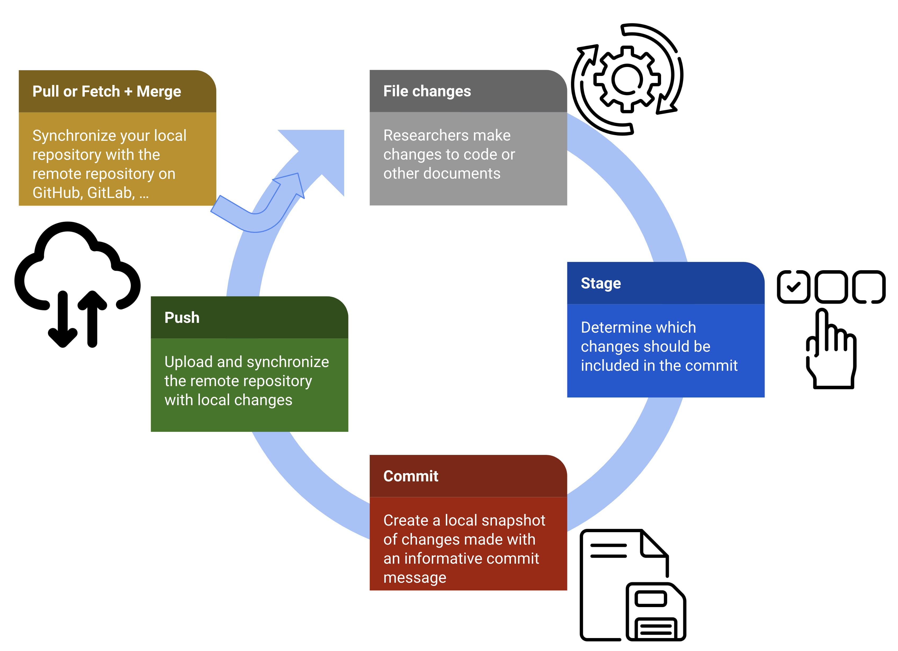

# FAIRification of pharmacoepidemiological research using `Git`

Transparency and reproducibility in conducting healthcare database studies in pharmacoepidemiology are critical scientific requirements for meaningful research. To increase the adoption of transparent and repdroducible workflows in real-world evidence (RWE) studies using VCS, this tutorial aims to give a practical introduction tailored for pharmacoepidemiologists on how to set up, structure, and implement workflows using `Git`, the most frequently used VCS to date.

## About

This repository hosts all documents and files for the manuscript project on...

```
The FAIRification of pharmacoepidemiological research: A practical introduction to reproducible analytical workflows using git and R
```

This manuscript is being drafted as part of the 2023 call for paper by the journal *Pharmacoepidemiology and Drug Safety (PDS)* focusing on **Pharmacoepidemiology Research Reproducibility**.

{out.width="50%"}

## Repository details

This repository contains the following sub-directories/-files:

* `README.md`: Short description and information about the project. 

* `manuscript`: Sub-directory where manuscript and supplementary material are stored.

* `renv`: Project-specific R package library. Fore more information, please visit the [renv website](https://rstudio.github.io/renv/articles/renv.html).

* `renv.lock`: `renv` lockfile that keeps track of all R packages and version.

* `.gitignore`: File to specify which files should not be tracked via git.

* `.Rprofile`: Environment file for R projects to store things like paths or keys (you can also setup an `.Renviron`)

* `.git`: Sub-directory where all `Git` changes are tracked

## Dependencies

To reproduce R scripts and Quarto files in this repository, `git clone` or `fork` it and run `renv::restore()`
